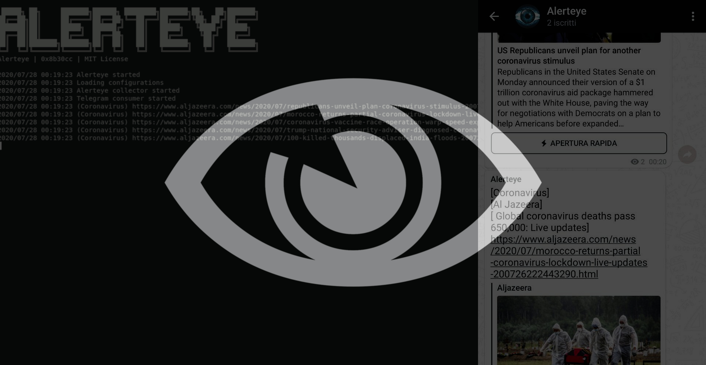

# Alerteye



Alerteye is a simple and lightweight RSS reader that sends alerts on configured topics through a Telegram bot. The Telegram bot can be configured to work inside groups or channels. Alerteye currently offers the following features:

* Receive real time updates on a Telegram group or channel.
* Configure filtered and unfiltered RSS sources.
* Configure topics with associated keywords.
* Receive only alerts that fits inside a configured topic from filtered RSS sources. 
* Configure one or more unfiltered sources in order to get every new item without filtering for a topic.
* Configure a blacklist in order to ignore articles containing certain keywords.

## Building from source
Compile for the current system
```
git clone https://github.com/x0e1f/Alerteye
cd Alerteye
make
```
Cross compile for raspberry pi

```
git clone https://github.com/x0e1f/Alerteye
cd Alerteye
sudo apt install gcc-arm-linux-gnueabi
make rpi
```

You can now move the executable (inside the bin folder) anywhere you want.

## Configuration

Start alerteye daemon
```
./alerteye
```

after the first execution a data folder is created with the following structure:

```
data
 |---alerteye.db
 |---alerteye.log
 |---config.json
```

The config.json file contains a default configuration:

```json
{
    "telegram_bot_token": "xxxx",
    "telegram_chat_id": "xxxx",
    "collector_time": 60,
    "send_time": 30,
    "topics": [
        {
            "name": "Coronavirus",
            "keywords": [
                "Coronavirus",
                "Covid-19"
            ]
        }
    ],
    "sources": [
        {
            "name": "Al Jazeera",
            "url": "https://www.aljazeera.com/xml/rss/all.xml",
            "filtered": true
        }       
    ],
    "blacklist": []
}
```
Once you have created a Telegram bot and have received a token, you can get your Telegram chat id (generally a channel or a group) with the following URL:

```
https://api.telegram.org/bot<bot-token>/getUpdates
```

You can configure as many topics and sources as you like. If you add a new source with the value of "filtered" to false, you will receive every new item in the feed without filtering for any topic. This can be very useful when you are sure that every new article from that source will interest you, but be sure to configure collect and send timing in order to avoid saturating the send queue.

```json
"sources": [
    {
        "name": "Al Jazeera",
        "url": "https://www.aljazeera.com/xml/rss/all.xml",
        "filtered": true
    },
    {
        "name": "Packet Storm",
        "url": "https://rss.packetstormsecurity.com/news/",
        "filtered": false
    }
]
```
You can configure the blacklist with a list of forbidden keywords. If a colected article contains at least one of those keywords it will be ignored.

```json
"blacklist": ["Donald", "Football"]
```

## License

The MIT License (MIT)

Copyright (c) 2020 Davide Pataracchia

Permission is hereby granted, free of charge, to any person
obtaining a copy of this software and associated documentation
files (the "Software"), to deal in the Software without
restriction, including without limitation the rights to use,
copy, modify, merge, publish, distribute, sublicense, and/or sell
copies of the Software, and to permit persons to whom the
Software is furnished to do so, subject to the following
conditions:

The above copyright notice and this permission notice shall be
included in all copies or substantial portions of the Software.

THE SOFTWARE IS PROVIDED "AS IS", WITHOUT WARRANTY OF ANY KIND,
EXPRESS OR IMPLIED, INCLUDING BUT NOT LIMITED TO THE WARRANTIES
OF MERCHANTABILITY, FITNESS FOR A PARTICULAR PURPOSE AND
NONINFRINGEMENT. IN NO EVENT SHALL THE AUTHORS OR COPYRIGHT
HOLDERS BE LIABLE FOR ANY CLAIM, DAMAGES OR OTHER LIABILITY,
WHETHER IN AN ACTION OF CONTRACT, TORT OR OTHERWISE, ARISING
FROM, OUT OF OR IN CONNECTION WITH THE SOFTWARE OR THE USE OR
OTHER DEALINGS IN THE SOFTWARE.
